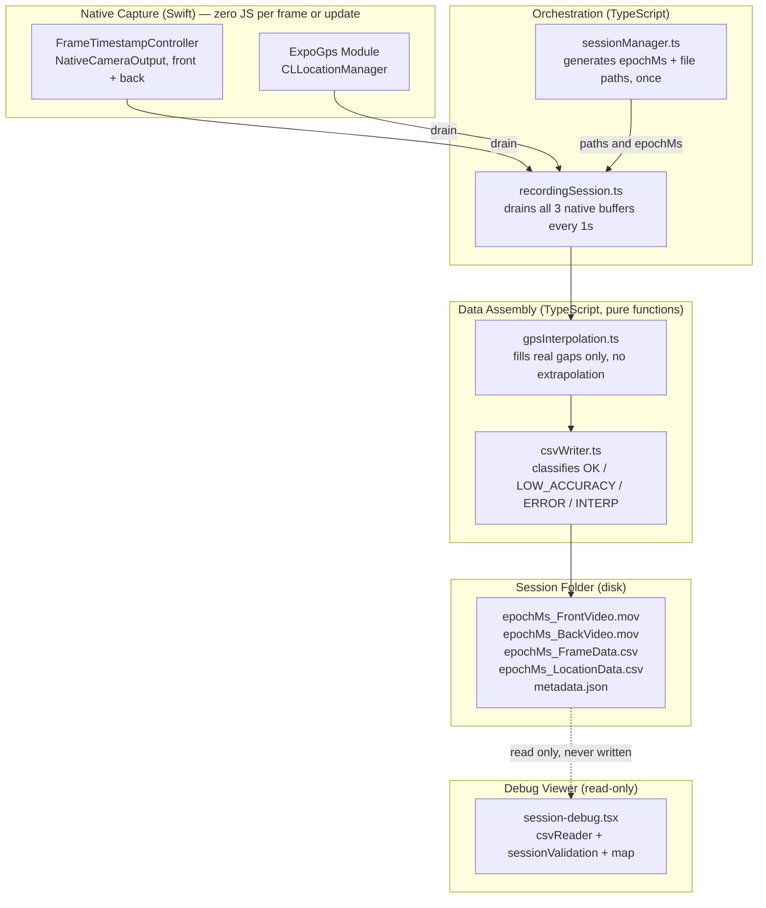

# SapiAR

Dual-camera + GPS data collection prototype, technical exercise for Sapios.

## Final Write-up

Testing was done on a real iPhone 12 Pro (2020), not a simulator, since
multi-cam capture and GPS motion need actual hardware. 30fps recorded
cleanly start to finish on every device test. 60fps sometimes lost
frame timestamps partway through a recording under sustained load,
though video and GPS kept working fine. The deliverable records at
30fps on purpose, not by default.

### How the two data streams stay in sync

Both CSVs share a Unix millisecond clock, but each one gets there
differently. Camera frames carry a timestamp measured against time since
the phone booted, not the real world clock. To fix that, the app reads
the real world clock and the boot clock once, back to back, at session
start. The gap between them becomes a fixed offset, added to every frame
timestamp. Frame to frame timing still comes from the hardware, since
the offset only repositions the series. GPS needs none of this. Its
timestamp is already a real world clock reading from the location
hardware.

### Tradeoffs

vision-camera's default per frame timestamp path runs a JavaScript
function on every frame. Not a precision problem, since the value is
identical, but it risks dropped frames under load and needs two extra
dependencies. This app reads timestamps in native Swift code, with no
JavaScript per frame. Native code never decides if a GPS point is
accurate or needs interpolating. That logic lives in TypeScript,
testable without a phone. Interpolation fills only real gaps between two
GPS points, never past a recording's edges, and never with an invented
speed or heading.

### Given more time

- Test more resolution and frame rate combinations to get 60fps reliable
  on this phone, alongside exposing Apple's hardwareCost API to
  JavaScript, missing from the camera library.
- Support Android. The orchestration layer abstracts the phone, so this
  means an Android camera module plus finishing the GPS module's Android
  stub, not a rewrite.
- Stream video and its timestamped GPS data to cloud storage as they're
  recorded, using the same native to app handoff, into one combined
  dataset instead of local files.

---

## Architecture



The boundary that matters most: anything touching a hardware timestamp
lives in the Native Capture layer, on the capture thread, with zero JS
involvement before the value exists in memory. Everything downstream of
an already-captured value (interpolation, classification, formatting)
lives in pure TypeScript. This split is why the pipeline stayed testable
without a device for most of the project, and why the three real
device-only bugs (checkpoint 8) were all inside the Native Capture layer,
not the Assembly layer.

---

## Getting Started

These are the exact steps that produced a working build from a clean
clone, verified today.

### Requirements

- Xcode, current stable version.
- A physical iPhone that supports Multi-Cam capture (iPhone XS or newer).
  The simulator cannot open more than one camera at once, so live
  preview and recording only work on a real device. Everything else
  (browsing a previously recorded session in the debug tooling, for
  example) works fine on simulator.
- Node and npm. `npm --version` should be 11.10.0 or higher for
  `.npmrc`'s security settings to take effect (see Prerequisites below if
  updating npm fails).

### Steps

```bash
git clone <repo-url>
cd SapiAR
npm ci
npx expo prebuild --clean
npx expo run:ios --device
```

Select your connected iPhone when prompted. First launch needs Xcode's
developer profile trusted on the device (Prerequisites below covers this
if the app installs but won't open).

For a build that doesn't need Metro running nearby, useful for testing
away from a computer, add `--configuration Release` to the last command
instead.

### What to expect

- Camera and location permission prompts on first launch.
- A live dual camera preview once permissions are granted, on a real
  device.
- A single record and stop button, plus a Sessions entry for reviewing
  past recordings (CSVs, GPS map, validation checks) directly on the
  device.
- Two sample recorded sessions are already included at
  `docs/sample-output/` for reference without needing to record anything
  new — `1784233996822_Session/` (the featured example: 30fps, real
  motion data, includes a config-ladder fallback to a binned resolution
  and its diagnostics) and `1784205721552_Session/` (the original clean
  30fps walk).

Prerequisites below covers the specific errors this setup hit during
development (CocoaPods version, npm version, device trust) and their
fixes, in case any of them show up on a different machine.

---

## Prerequisites / Known Setup Gotchas

Environment issues hit during development — documented so a fresh clone doesn't lose time rediscovering them.

- **CocoaPods must be >= 1.13.0.** Older versions fail `pod install` with `Unrecognized option(s) always_out_of_date in script phase` — Expo's generated `Podfile` uses a script-phase option older CocoaPods doesn't recognize. Fix: `brew upgrade cocoapods` (or `gem install cocoapods`), then `cd ios && pod deintegrate && rm -rf Pods Podfile.lock && cd .. && npx expo run:ios`.
- **npm CLI must be >= 11.10.0** for `.npmrc`'s `min-release-age` to take effect. Don't jump straight to `npm@latest` — as of npm v12, the engine requirement is Node `^22.22.2 || ^24.15.0 || >=26.0.0`; on an older Node, `npm install -g npm@latest` fails with `EBADENGINE`. Use `npm install -g npm@11` instead unless Node is already current.
- **First run on a physical iOS device:** after `npx expo run:ios --device`, the app installs but launch fails with a code-signature error unless the developer profile is explicitly trusted: **Settings → General → VPN & Device Management → [Apple ID] → Trust**. Standard iOS behavior for free/personal developer accounts, not a build issue.

---

## TL;DR (Bitácora Highlights)

Six findings worth reading first, each pointing at its full entry below.

1. Frame timestamps use vision-camera v5's `NativeCameraOutput` extension
   point instead of the JS-worklet Frame Processor Plugin path, avoiding
   the exact per-frame JS hop the project's core principle forbids
   (checkpoint 3).
2. Two independent capture paths converge on the same Unix-ms axis
   through different, documented routes. Frames anchor a host-clock
   series once per session. GPS reads a wall-clock timestamp directly.
   This is the real synchronization design (checkpoints 3-4).
3. Native modules emit raw hardware values only. Every classification
   (`OK`, `LOW_ACCURACY`, `ERROR`, `INTERP`) lives in pure, unit-tested
   TypeScript, testable without a device (checkpoints 4, 6-7).
4. Three device-only bugs were found and root-caused in vision-camera v5
   itself. A crashing preview-buffer optimization, a broken
   `setOutputSettings` under multi-cam, and missing resolution-negotiation
   intent that silently capped quality 9x. None of these reproduced on
   simulator (checkpoint 8).
5. Real outdoor testing found a sustained-load resilience issue. 60fps
   intermittently loses frame-timestamp delivery mid-recording under
   multi-cam pressure while video and GPS stay healthy. 30fps proved
   stable across every test, so the deliverable uses 30fps on purpose,
   not by default (checkpoint 10).
6. Two resilience layers shipped the same day instead of one unverified
   guess. A degrading config ladder handles bring-up failures. A
   persistent Events log handles observability. Both state their limits
   honestly instead of hiding behind a green checkmark.

---

## Technical Decision Log

Entries added per checkpoint, in the moment, while the reasoning is fresh —
not reconstructed from memory afterward.

### Checkpoint 0 — Tooling

- ESLint pinned to 9.x, not 10: `eslint-config-expo`'s internal
  `eslint-plugin-react` depends on `context.getFilename`, removed in ESLint 10.

### Checkpoint 2 — Dual camera preview

- vision-camera v5 uses an imperative Nitro API (`supportsMultiCamSessions` →
  `createDeviceFactory()` → `supportedMultiCamDeviceCombinations` →
  `createCameraSession()` → `configure()` → `start()`), not the v4 declarative
  `<Camera>` component. No Expo config plugin ships with v5; camera
  permission is declared via `ios.infoPlist.NSCameraUsageDescription`.
- Device combination selection is constrained to whatever
  `supportedMultiCamDeviceCombinations` reports as hardware-supported —
  never a manually constructed front+back pairing.

### Checkpoint 3 — Frame timestamp capture

- **The core sync problem:** `FrameData.csv` needs one row per frame with
  the hardware `presentationTimeStamp`, captured with zero JS involvement
  before the value exists in memory (CLAUDE.md's core principle).
- **Why not vision-camera's Frame Processor Plugin path:** it routes
  through a synchronous JS `onFrame` worklet per frame. This is not a
  timestamp-accuracy problem — `presentationTimeStamp` would be identical
  either way, since it's a value already recorded in the buffer, not
  something measured at read time. The real risk is completeness and
  dependencies: a per-frame JS worklet in the capture hot path can cause
  backpressure-driven frame drops if it doesn't finish before the next
  frame arrives, and requires two extra packages
  (`react-native-vision-camera-worklets`, `react-native-worklets`).
- **What we used instead:** a custom native camera output conforming to
  vision-camera v5's public `NativeCameraOutput` protocol — an officially
  documented extension point (see Margelo's "What's New in VisionCamera
  V5"), not a workaround. A `FrameTimestampController` per camera (front/
  back) is appended directly to the session's `outputs` array; its
  `AVCaptureVideoDataOutput` delegate runs entirely on the native capture
  thread. Zero JS in the per-frame path.
- **Unix-ms conversion:** `presentationTimeStamp` lives on the host clock
  (time since boot), not the Unix epoch. A once-per-session anchor —
  `clock_gettime(CLOCK_REALTIME)` and `CMClockGetTime(CMClockGetHostTimeClock())`
  read back-to-back — offsets the series onto Unix time. Frame-to-frame
  deltas come 100% from the hardware clock; the anchor only positions the
  series. This is not the forbidden per-frame `Date()` pattern: the anchor
  is computed once, not per row.
- **Tooling constraint found:** nitrogen 0.36.1 (vision-camera's Nitro spec
  codegen) cannot handle cross-module spec inheritance (`extends
CameraOutput` generates uncompilable Swift). Specs are standalone;
  `getCameraOutput()` returns the external `CameraOutput` HybridObject by
  value instead — the same pattern vision-camera's own nitro-image
  integration uses internally.
- **Real-world verification (iPhone 12 Pro, 47s continuous):** zero dropped
  frames on either camera. Back steady at 24.06 fps, front steady at 60.06
  fps (measured empirically — see next point). `drain()` at t=15s returned
  363 rows (back) / 908 (front), spanning 15.04s / 15.14s against the 15s
  wall-clock window: hardware timestamps are internally self-consistent.
- **Open item carried to checkpoint 8:** no explicit FPS constraint was set
  this checkpoint, so v5 didn't report a negotiated FPS
  (`onSessionConfigSelected` came back `undefined`) — fps was measured from
  raw counts instead. The back camera's default-negotiated 24fps is also
  below what GOAL.md's "highest available quality" calls for. The recording
  checkpoint must set an explicit FPS constraint, which fixes both issues.

### Checkpoint 4 — GPS capture (Expo Module)

- **Capture/classification split:** the Swift module emits raw CoreLocation
  values only — `CLLocation.timestamp` as Unix ms, lat/long, and
  speed/course/accuracy passed through with CoreLocation's own negative
  "unavailable" encoding intact. The ≤20m threshold, `quality_flag`, `-1`
  mapping, and ERROR sentinel rows are TS data-assembly work (checkpoints
  6/7), so the classification logic stays unit-testable without a device.
- **No clock anchor needed here** — unlike the frame path:
  `CLLocation.timestamp` is already a wall-clock `Date` from the fix, so
  `timeIntervalSince1970 × 1000` is the hardware timestamp. The two capture
  paths converge on the same Unix-ms axis via different, documented routes.
- **Hardware errors are stream entries, not exceptions:** `didFailWithError`
  appends a distinct `errorCode` entry to the same chronological buffer.
  Verified organically on the simulator — CoreLocation emitted a transient
  error before its first fix and it appeared in the drain as an error entry
  rather than vanishing.
- **Continuous-capture knobs that matter:** `kCLLocationAccuracyBest` +
  `distanceFilter = kCLDistanceFilterNone` (every update, per GOAL.md §3)
  and `pausesLocationUpdatesAutomatically = false` — iOS silently pauses
  updates otherwise, which would fake a GPS gap.
- **API shape mirrors the frame module** (`drain()` / `count`, NSLock'd
  buffer, main-thread CLLocationManager for its run-loop requirement) — one
  pattern for both native capture modules.
- **Verified (simulator):** 1 Hz sustained updates, monotonic timestamps
  (span 20.9s over a 20s window), raw negatives on the first no-motion fix,
  drain round-trip, permission flow. **Pending:** moving-fix speed/course
  (dev-client reload channel broke; 3 attempts, stopped per AGENTS.md) and
  the real-device walk — both queued as the first minutes of checkpoint 5's
  session.
- **Real-device finding (iPhone, indoor, stationary/light movement):**
  first `drain()` at t=20s returned 8 fixes spanning **80.2s** — physically
  impossible within a 20s-old session. Root cause: `CLLocationManager`'s
  first delivery on a fresh authorization is commonly a **cached
  last-known-location** from before the manager started (`buffered` jumped
  straight to 5 at t=1s, confirming a startup burst rather than 5 fresh
  reads in one second), not a live fix. Expected CoreLocation behavior, not
  a bug in our capture code — but it's an **open design decision for
  checkpoints 6/7**: `LocationData.csv` is named `{epochMs}_...`, implying
  everything in it belongs to that session; a fix timestamped before the
  session's `epochMs` should not silently land in the file. Needs an
  explicit filter (drop or flag fixes with `timestamp < epochMs`) in the
  CSV-assembly stage.
- **Speed/course still unresolved on real hardware too:** 8/8 fixes had
  `speed<0`/`course<0` (indoor walk within a small room, `hAcc` 12-24m —
  the movement was inside the fix's own error margin, so CoreLocation had
  no basis to report either). Not a new finding, but confirms the
  simulator's gap wasn't a simulator-only artifact. Still deferred to
  checkpoint 10's real outdoor recording, where actual walking speed will
  exceed GPS noise.

### Checkpoint 5 — sessionManager.ts

- **First TDD checkpoint** (per AGENTS.md): 8 failing-first Jest tests cover
  GOAL.md §6 naming exactly (including `metadata.json` carrying no epoch
  prefix), single-epochMs threading, purity/trailing-slash normalization,
  and once-only epoch generation with folder creation (mocked FS).
- **`Date.now()` is legal here, and only here:** `epochMs` is the session's
  _identity_ — the folder-naming timestamp GOAL.md §6 defines as "the moment
  recording started" — not a data timestamp. Architecture Rule #4 assigns
  its generation to sessionManager.ts in TS; every CSV row still carries
  only native hardware clocks. The distinction is documented at the call
  site because it looks like a violation of the no-`Date()` rule without
  that context.
- **Pure/FS split:** `buildSessionPaths(epochMs, containerUri)` is a pure
  function (fully unit-tested); `startSession()` is the thin orchestration
  that reads the clock once, builds paths, and creates the folder via
  expo-file-system v57's `Directory` API.
- **Toolchain friction, same shape as ESLint 9/10:** jest must stay on the
  **29.x line** — jest-expo@57 bundles jest-29 internals (`jest-mock@29`),
  and jest 30's runtime calls APIs they lack
  (`clearMocksOnScope`). Also, `min-release-age` blocked both
  `jest-expo@57.0.2` and `expo-file-system@57.0.1` (published hours before
  this session) — pinned the prior releases instead of lowering the
  cooldown, per AGENTS.md. TypeScript 6 no longer auto-includes `@types/*`;
  `"types": ["jest"]` added to tsconfig.
- **Flagged, not guessed (per Session Discipline):** folder-lifecycle edge
  cases are unspecified in CLAUDE.md/GOAL.md — (1) what to do if
  `{epochMs}_Session/` already exists (current behavior: `Directory.create()`
  throws — plausibly correct as an unrecoverable state, but undecided), and
  (2) whether a cancelled/failed session should delete its folder. Both need
  an owner decision before checkpoint 8 wires the record button.
  _Resolved: Architecture Rule #8 now says let it throw, no special cases._

### Checkpoint 6 — gpsInterpolation.ts

- **TDD, red-first:** 12 tests written before the implementation, covering
  every case the checkpoint mandated — pass-through, gap exactly at
  threshold (not interpolated: strictly-above triggers), single/multiple
  gaps, error-entry-inside-a-gap, leading/trailing errors, empty/single
  inputs, input immutability, and the continuity property itself (no
  consecutive positioned-point delta above threshold — the exact check
  CLAUDE.md's Validation Strategy runs against real data in checkpoint 10).
- **Threshold: 3000 ms, parameterized.** 3× the 1 Hz cadence verified
  on-device in checkpoint 4: one missed update (~2 s silence) is normal
  jitter, two or more is a real gap. Exported as a constant so checkpoint 7
  passes it explicitly.
- **Synthetic rows carry interpolated lat/long only; kinematics and
  accuracies are `-1`.** GOAL.md §4's requirement is positional continuity
  ("no large holes"); speed/course/accuracy on a synthetic row would be
  fabricated sensor data. The bounding fixes frequently carry `-1`
  themselves (the stationary case from checkpoint 4), so per-field
  interpolate-or-not rules would add complexity to produce fake precision.
  `INTERP` + `-1` keeps synthetic rows unmistakable downstream.
- **Fill density:** `ceil(gap/threshold) − 1` evenly spaced points, so no
  resulting delta exceeds the threshold — the output satisfies the
  continuity property by construction.
- **Hardware-error entries are not gap boundaries** — they carry no
  timestamp/position, so nothing can be interpolated from them. They pass
  through in arrival order; the gap is measured between real fixes. (Edge
  case GOAL.md doesn't address; decided + tested explicitly.)
- **No extrapolation at array edges:** a gap with only one bounding fix is
  left alone — linear interpolation needs two bounds, and extrapolating
  fabricates a trajectory. The function also can't see session start/stop
  times by design; whether the session's first/last seconds need coverage
  is a checkpoint 7/8 (assembly) question, flagged not guessed.
- **Ownership boundary honored:** this module assigns only `INTERP` on
  points it creates. Real and error entries pass through byte-identical
  (same references) — `OK`/`LOW_ACCURACY`/`ERROR` classification is
  csvWriter's (checkpoint 7).

### Checkpoint 7 — csvWriter, buffers, metadata

- **TDD, red-first:** 21 new tests (41 total across the TS pipeline) —
  headers pinned character-exact to GOAL.md, the 20 m boundary (exactly 20 m
  is `OK`; strictly above is `LOW_ACCURACY`), ERROR sentinel with every
  numeric field `-1` **including `Timestamp_unix_ms`** (per the Data Spec
  clarification — the internally-known error arrival time is deliberately
  not preserved), INTERP rows passing through unmodified, frame rows for
  both cameras, and the pre-session filter's ordering guarantee.
- **Pre-session cached fixes are dropped, and the filter runs BEFORE
  interpolation.** A cached fix (checkpoint 4's 80.2 s-span finding) isn't
  this session's data — but the sequencing is the real safety property: had
  interpolation run first, the cached fix would anchor synthetic points
  that never happened. The ordering test constructs exactly that scenario
  (cached fix 40 s pre-epoch + two session fixes 2 s apart) and asserts
  zero INTERP rows reach the file. Error entries carry no timestamp and are
  kept — they occurred during the session and owe the file a sentinel row.
- **Flush windows are append-only via a carried-over last fix.** The
  location pipeline (filter → interpolate → format) runs per flush; the
  previous window's last real fix is prepended as interpolation context so
  a gap spanning two flushes is still detected — no whole-file rewrites,
  no missed cross-window gaps. Tested with a 10 s gap split across two
  flushes (3 INTERP rows appear, correctly ordered).
- **Edge cases decided (GOAL.md silent), flagged in code:** negative
  horizontal accuracy (CoreLocation invalid-fix marker) writes `-1` and can
  never be `OK` — an invalid fix can't claim ≤20 m confidence; timestamps
  are written as integer ms (sub-ms is below both sensors' meaningful
  resolution).
- **metadata.json schema** (unspecified in GOAL.md): minimal — epochMs,
  durationMs, per-camera frame counts, GPS row counts by type
  (real/interpolated/error), negotiated fps when known. The counts exist to
  cross-check the CSVs; nothing speculative added.
- **expo-file-system v57 append API:** `FileHandle` exposes `writeBytes`
  (no string `write`) — rows are `TextEncoder`-encoded per flush,
  `FileMode.Append` keeps files append-only.
- **Still open for checkpoint 8:** the seconds between `epochMs` and the
  first GPS fix (and between the last fix and stop) are uncovered by
  design — interpolation needs two bounds and the pipeline never sees
  session stop time. Whether that leading/trailing window needs rows is an
  assembly/product question, flagged not guessed.
  _Resolved: Architecture Rule #9 — no extrapolation at session edges._

### Checkpoint 8 — Recording pipeline wired end-to-end

- **The hardware-budget question resolved by reading the source:** v5's
  default recording path is `AVCaptureMovieFileOutput` (internal encode of
  the already-negotiated stream — `enablePersistentRecorder` stays off), so
  recording adds no new frame-streaming consumer. Multi-cam cost is
  dominated by sensor-format bandwidth, which this checkpoint _reduces_:
  explicit `{ fps: 30 }` at a 1080p target versus checkpoint 3's
  unconstrained formats (front had negotiated 60 fps). The `configure()`
  throw remains the explicit arbiter and now surfaces in the UI error state.
- **Crash found on device, root-caused, fixed by removal:** the
  "belt-and-suspenders" bandwidth mitigation this checkpoint initially
  shipped — `deliversPreviewSizedOutputBuffers = true` on the timestamp
  outputs (checkpoint 3's documented-but-never-validated fallback) —
  **crashes 100% reproducibly at launch on real hardware**:
  `NSInvalidArgumentException` from `FrameTimestampCameraOutput.init()`,
  because the property rejects data-only outputs with no preview layer, and
  Swift cannot catch Objective-C exceptions (EXC_BREAKPOINT trap). Fix:
  removed outright — not wrapped — since an ObjC++ exception bridge isn't
  worth building for an optimization the budget analysis shows unnecessary.
  Write-up material: a documented mitigation that was wrong the first time
  it met hardware; the lesson is that fallbacks belong behind the same
  validation bar as primary paths.
- **Second device-found bug, same session: the CSV files were never
  created.** expo-file-system's `FileHandle` in Append mode
  opens-but-never-creates; checkpoint 5's sessionManager deliberately
  creates only the folder ("paths and lifecycle", no content), and
  checkpoint 7's buffers assumed the file existed at first append — the
  responsibility fell in the gap _between_ two correctly-tested modules.
  Fix: `recordingSession` creates both empty CSVs at session start
  (orchestration owns "getting the pipeline ready"; sessionManager's
  checkpoint-5 boundary stays untouched). Files are created truly empty —
  headers remain buffer-owned, written on first flush (checkpoint 7's
  existing decision). The `.mov` side has no such gap, confirmed with
  hardware evidence: the failed session's folder contains both video files
  and no CSVs — the Recorder creates its own output. Write-up material for
  "what I'd improve": each checkpoint's unit tests correctly assumed the
  other's preconditions, so only an integration test of
  session-start-to-first-flush (or a real device run) could catch this —
  that test is the first thing to add given more time.
- **Fix verification status:** crash fix confirmed on hardware (app
  launched and stayed alive well past the camera mount that previously
  trapped 100% of launches). CSV-creation fix is pinned by a failing-first
  unit test (48 total) and awaits the first successful device recording
  for end-to-end confirmation.
- **Third device-found bug: `setOutputSettings` called before
  `configure()`.** Two unhandled promise rejections per launch ("Cannot set
  output settings when VideoOutput is not yet connected") — the HEVC codec
  setter ran at output creation, but the v5 contract (in the source, not
  the error message alone) requires it _after_ `configure()` attaches the
  output and _before_ `createRecorder()`. Root-caused with evidence from
  the failed session's videos: **codec-only** — the FPS constraint is
  declarative in the connections and did apply (`fps=30.003` back /
  `29.997` front read straight from the `.mov` tracks — checkpoint 8's
  24→30 objective landed), and the rejected codec setter was masked by the
  library default already choosing `hvc1`/HEVC. Fix: setter moved after
  `configure()`, properly awaited, errors surfacing in the UI. Verified
  zero rejections on a fresh Metro-connected launch.
- **New finding flagged (not chased in the bugfix session): negotiated
  recording resolution is 640×480**, far below the 1080p target — read
  from the same `.mov` tracks. Independent of the codec bug (that setter
  doesn't touch resolution); the format negotiation across 6 outputs is
  settling on the smallest multi-cam format. Needs its own investigation —
  candidate causes: aspect-ratio weighting of the FHD 16:9 target against
  4:3 multi-cam formats, or the `.any`-resolution timestamp outputs
  dragging negotiation down.
- **Resolution root cause found (fourth device session): missing
  negotiation _intent_, not topology.** Five on-device experiments —
  HIGHEST_4_3 target alone, no timestamp outputs, video-only connections,
  alternate device combination, no FPS constraint — all still negotiated
  640×480. The fix: vision-camera's constraints "describe intent", and no
  resolution intent was ever expressed. Adding
  `{ resolutionBias: videoOutput }` + `{ binned: false }` to each
  connection's constraints moved negotiation to **1920×1440 @ 30 fps on
  both cameras** (9× the pixels) with the full 6-output topology intact —
  target resolution on the output alone is provably insufficient under
  multi-cam.
- **`setOutputSettings` is unusable under multi-cam — a vision-camera v5
  bug, not a format issue.** The codec-crash hypothesis (HEVC missing at
  the binned format) was disproven on device: `getSupportedVideoCodecs()`
  lists `h265` at every tested format, yet `setOutputSettings` throws the
  same uncatchable ObjC exception at 640×480-binned **and** at
  1920×1440 non-binned. It has never once succeeded in a multi-cam
  session. Resolution: never call it; rely on the library's default codec,
  which is empirically HEVC/`hvc1` on this hardware (verified from
  recorded files) — with a one-shot log of supported codecs per run as
  standing evidence. Write-up material: two library behaviors (negotiation
  needing explicit intent; a setter broken under multi-cam) that only real
  hardware could reveal.
- **End-to-end verification (real 64 s device recording, final config) —
  every bar cleared:** both `.mov`s HEVC/`hvc1` at **1920×1440, 30.00 fps**
  (probed from the files, not assumed); frame capture 1928 front / 1929
  back vs ~1932 expected (99.8%, ±4-frame boundary slop, effectively zero
  drops); FrameData row count cross-checks metadata exactly; GPS 64 real
  fixes at 1 Hz + **3 INTERP rows filling a real gap** with max
  consecutive delta 2543 ms ≤ the 3000 ms threshold (the Validation
  Strategy continuity check, passing on real data); zero pre-session
  timestamps in the CSV (cached-fix filter verified end-to-end);
  `metadata.json` valid and consistent (fps 30/30 — checkpoint 3's
  24 fps open item closed with negotiated, recorded proof).
- **FPS constraint (checkpoint 3's carried item):** `{ fps: 30 }` on both
  connections — uniform rate on hardware whose multi-cam formats cap at 30,
  and uniform frame-count arithmetic (30 × duration × 2). On-device
  before/after numbers pending the first real recording (metadata.json
  carries the negotiated values).
- **HEVC explicit** (`setOutputSettings({ codec: 'h265' })`), audio off (not
  in GOAL.md; avoids the mic permission). Recorders write **directly into
  the session folder** — `RecorderSettings.filePath` takes an absolute
  filesystem path with parents auto-created, so GOAL §1 naming comes
  straight from sessionManager with no temp-file move.
- **Video outputs join the session at mount, recorders per session:**
  reconfiguring a live session re-negotiates formats and glitches the
  preview; an idle `MovieFileOutput` does no encode work. A `Recorder`
  records once — each record-start creates fresh ones.
- **Session-boundary hygiene:** record-start drains-and-discards everything
  the timestamp controllers buffered since preview mount, plus a
  `timestamp >= epochMs` frame filter for the one-tick boundary slop —
  FrameData.csv only ever contains this session's frames.
- **One 1 s cadence** drains all three native modules → appends → flushes:
  ~60 frame rows per write is already "periodic, not per-row" without a
  second timer.
- **TDD:** 5 orchestrator tests (fakes for controllers/recorders, fake
  timers, mocked FS) — pre-record discard, epoch filter, session-path
  recording + stop finalization, GPS lifecycle, metadata correctness.
  47 tests total.
- **Verified:** simulator boot smoke (clean minimal UI, correct no-multi-cam
  degradation, scaffolding gone). **Pending — the device e2e:** the app is
  installed on the iPhone (build succeeded; auto-launch blocked by device
  lock). First real record/stop run confirms playable HEVC `.mov`s, CSV
  spot-checks, metadata, and the negotiated-FPS numbers.

### Checkpoint 9 — session-debug.tsx

- **Strictly a viewer:** every displayed value is read or grouped from the
  already-written CSVs (`src/csv/csvReader.ts`, TDD'd with fixture content:
  parsing, quality-flag counts, consecutive-INTERP gap runs). No
  interpolation math, no classification logic — Architecture Rule #7 held
  by construction.
- **`react-native-maps@1.29.0`** with the default Apple Maps/MapKit
  provider: no API key, no config plugin entry, no third-party tile
  network. Its transitive `fsevents` install script was explicitly
  **denied** (optional macOS dev watcher; watchman already covers Metro).
- **Verified against the real 64 s session** (copied into the simulator's
  app container, so the visual check ran on real data): frame counts
  1928/1929 and flag counts OK:64 / INTERP:3 match checkpoint 8's numbers
  exactly.
- **The viewer corrected the record:** checkpoint 8's session report
  described "3 INTERP rows filling one real gap" — the gap list shows the
  truth from the CSV structure: **three separate ~5 s gaps** (at +1.0 s,
  +7.2 s, +12.1 s), each filled with one synthetic point
  (`ceil(5/3)−1 = 1`), all during the GPS warm-up window. metadata.json
  only stores the interpolated total, so this structure is exactly what
  the debug screen exists to surface.
- **Honest visual-check caveat:** real-vs-INTERP marker colors exist
  (blue/orange), but this session was recorded stationary — all 67 points
  sit within ~1 m and overlap at any zoom. The distinction becomes
  observable with checkpoint 10's outdoor walk; not a code defect.
- **Session selection kept trivial** per the checkpoint: folder listing of
  `{epochMs}_Session/` sorted newest-first, tap to open; a discreet
  "Sessions" entry on the record screen (hidden while recording).

#### Checkpoint 9 extension — inspection tooling (pre-checkpoint-10)

- **Raw row viewers:** every FrameData/LocationData row, every column,
  rendered verbatim from `parseRawRows` (a trivial split in csvReader —
  still zero re-parsing logic), virtualized via FlatList for the ~1900-row
  frame files.
- **Video playback** via `expo-video@57.0.0` (57.0.1 was published hours
  before this session — `min-release-age` blocked it again, prior version
  pinned; no install scripts to review). Native controls only; file sizes
  shown next to each player. Verified playing the real HEVC 1920×1440
  session videos.
- **Whole-session delete** with confirmation dialog, per amended
  Architecture Rule #7 — the screen's only write-adjacent action, and it
  never touches individual files.
- **Automated validation panel:** CLAUDE.md's Validation Strategy checks
  now run in-app as pure TDD'd functions (`sessionValidation.ts`, 10 new
  tests): frame count vs `metadata.json`'s fps×duration (tolerance
  max(5, 1%) — measured boundary slop is ±4 frames), live GPS continuity
  against the real threshold, and ERROR-sentinel integrity that reports
  "not exercised" instead of a false pass when a session has no error
  rows. Verified against the 64 s session: front 1928/1932 PASS, back
  1929/1932 PASS, continuity 2543 ms ≤ 3000 ms PASS, sentinel not
  exercised. Write-up material ("what I'd improve"): the fact that four
  recordings' checks were run by hand before this existed is itself the
  limitation this feature names — validation tooling should have landed
  with the pipeline, not after it.
- **Also shown:** raw metadata.json, quality-flag percentages, video file
  sizes. Deliberately NOT shown: video resolution cross-check — the
  pipeline doesn't export negotiated resolution into metadata.json.
  Flagged rather than probed fresh from the video files here: if the
  cross-check matters, the pipeline should export it (checkpoint 10
  candidate), not the viewer re-derive it.
- **Post-hoc fix from device console testing: React keys must never be CSV
  timestamps.** Duplicate-key warnings traced to detail-screen markers
  keyed by `timestampMs` — CSV timestamps carry no uniqueness contract
  (GOAL.md wants _every_ available update; redelivered fixes and same-ms
  rounding are legitimate distinct rows). All row-derived keys are now
  positional, and a regression test pins the contract (duplicate-timestamp
  rows must survive parsing). The session list itself was exonerated:
  folder names are filesystem-unique and the delete-refresh replaces whole
  state. Same investigation surfaced and fixed a record-button double-tap
  race (session start not claimed until after an await — a fast second tap
  could launch a concurrent session over the same native buffers).

### Pre-checkpoint-10 — ERROR sentinel proven on real hardware; resolution exported

- **The ERROR sentinel row is now proven end-to-end on a real device** —
  a 19 s indoor recording with GPS starved by airplane mode. The sample
  output folder for this specific finding was not kept in the repo, the
  full `LocationData.csv` is quoted below. The deliverable sample output,
  from checkpoint 10's outdoor walk, is in `docs/sample-output/`.

  ```csv
  Timestamp_unix_ms,Lat,Long,Speed_m_s,Course_deg,CourseAccuracy_deg,HorizontalAccuracy_m,VerticalAccuracy_m,is_interpolated,quality_flag
  -1,-1,-1,-1,-1,-1,-1,-1,0,ERROR
  1784169476533,-38.00871814204318,-57.550821264186716,-1,-1,-1,12.795014,30.970958114416394,0,OK
  ```

  Every numeric field `-1` including the timestamp (the Data Spec's
  literal reading), `is_interpolated=0`, and the row was written — not
  silently dropped — exactly the "never leave a gap" property CLAUDE.md's
  Validation Strategy wanted forced. Zero `INTERP` rows is correct here,
  not a miss: only one real fix exists, and interpolation needs two real
  bounds (Architecture Rule #9).

- **The single real fix arrived 91 ms after `epochMs`** — far too fast
  for an unassisted satellite acquisition under airplane mode. This is
  almost certainly CoreLocation's cached last-known-location first
  delivery, the same startup behavior documented in checkpoint 4 — but
  timestamped fresh (post-epoch), so the pre-session filter correctly
  kept it. Known CoreLocation behavior, not a new bug; noted so nobody
  reads that fix as a live airplane-mode acquisition.
- **Implication for checkpoint 10:** the airplane-mode toggle is now
  optional evidence-gathering, not a blocking requirement — the ERROR
  path has real-hardware proof. The outdoor walk should spend its time
  on what's still unproven: real motion (the speed/course pending item
  open since checkpoint 4) and enough duration for a natural GPS gap to
  show `INTERP` on a moving track.
- **Negotiated resolution now exported to `metadata.json`** (closing the
  gap checkpoint 9 flagged): a `resolution` field
  (`{ front: {width, height}, back: {...} }`) read from the video
  outputs' `currentResolution` at session stop — by then the value has
  been stable all session, avoiding the populate-race a mount-time read
  has (checkpoint 8's delayed log). Note: `onSessionConfigSelected`'s
  payload carries no resolution (only fps/stabilization/pixel-format/
  binning), so the value comes from the already-held video outputs in
  `RecordingDeps` — still no new capture path. Omitted (like `fps`) when
  never reported. TDD: 3 new/updated tests, 71 total.

### Checkpoint 10 — sustained-load frame stall, distinct from bring-up

Real outdoor testing surfaced a second camera-resilience issue — not the
bring-up `hardwareCost` overage the config ladder (below) handles, but
degradation **mid-recording**, under sustained load. Four consecutive
recordings, same app session, no restart between them:

| Test | Config                          | Gap from prior | Clean frames                                | Outcome                                               |
| ---- | ------------------------------- | -------------- | ------------------------------------------- | ----------------------------------------------------- |
| 1    | 60fps, long walk                | fresh launch   | 222.4s @ 60fps, both cams, near-zero jitter | 0 frames for the remaining 168.5s of a 390.9s session |
| 2    | 60fps, airplane toggle mid-walk | +17s           | 0                                           | never delivered a single frame, entire 136.8s session |
| 3    | 60fps, airplane full-session    | +9.9s          | 28.1s @ 60fps, both cams                    | 0 frames for the remaining 168.5s of a 196.6s session |
| 4    | 30fps, short walk               | +53.3s         | 154.8s @ 30fps, full session                | clean throughout — chosen as the sample output        |

Video (`.mov`, both cameras — confirmed by playback duration matching
session duration) and GPS (1Hz uninterrupted through tests 1–3, unaffected
by the frame-capture silence) were healthy in every test. Only
`FrameTimestampController`'s delivery degraded — evidence iOS is
selectively deprioritizing what it can treat as a non-essential stream
under sustained multi-cam 60fps load, not tearing down the session.

A striking, unverified coincidence: tests 1 and 3 died with **168.45s**
and **168.46s** remaining in their respective sessions — 13ms apart,
despite wildly different elapsed clean-capture time before the cutoff
(222.4s vs 28.1s). Consistent with a shared, session-duration-independent
cutoff rather than pure cumulative heat buildup — but two data points
can't confirm a mechanism. Flagged as observation, not conclusion.

Root-causing this precisely would need live
`AVCaptureDevice.systemPressureState`/`ProcessInfo.thermalState`
instrumentation across several real multi-minute recordings — out of
scope today, same reasoning as the `hardwareCost` preflight deferral
below. **Decision:** 30fps is the practical "highest available quality"
for this multi-cam topology — `GOAL.md`'s own wording supports this once
"available" is read as _sustainable for a real session_, not just the
largest number a spec sheet allows. Test 4 (30fps) is the deliverable
sample output; the three 60fps walks are retained as evidence for this
finding, not discarded.

Chose observability over an unverified fix: the Events tab (below) ships
instead of active mid-session stall detection, which would need
continuous frame-count polling logic built and tested same-day under
deadline pressure. The tab's own empty/caveat state says explicitly that
it can't catch this specific failure mode (no accompanying iOS-level
event fires when it happens) — the gap is documented, not hidden behind
a green checkmark.

- **Intermittent black preview on unplugged cold launch — investigated,
  NOT root-caused.** Time-boxed investigation, honest outcome: the device
  was reachable only over USB tonight (the failing condition is
  specifically _unplugged_ cold launch, which may not reproduce cabled),
  a cold launch loads the embedded JS bundle (so `console.log` evidence
  never reaches Metro), and streaming the device's unified log needs a
  cabled Console.app session. What static analysis does rule out: the
  configure-before-discovery race — `App.tsx` awaits
  `createDeviceFactory()` → combination selection →
  `createCameraSession()` → `configure()` → `start()` strictly
  sequentially, so device discovery is fully resolved before `configure()`
  on every launch, cold or warm. The "resolved after ~5 relaunches"
  observation remains consistent with either a system-level interruption
  (thermal/system pressure) or a session that silently never started —
  indistinguishable without the signals below.
- **Safety net shipped instead of a guessed fix: a camera health banner
  that doubles as the diagnostic instrument.** vision-camera v5 already
  bridges the exact AVFoundation notifications the investigation wanted
  (`addOnErrorListener`, `addOnInterruptionStartedListener` with reasons
  including `video-device-not-available-due-to-system-pressure`,
  `addOnStarted/StoppedListener`) — no native code needed (Ponytail
  rung 5). Two layers: (1) a 5 s frame-flow watchdog armed before
  `configure()` (so a hang in `configure()`/`start()` still trips it) —
  if either camera's timestamp controller has delivered zero frames,
  a "Camera not responding — tap to retry" banner appears; (2) session
  listeners that put the _interruption reason or error message_ in the
  banner text. Tapping retries via the same teardown-and-renegotiate
  path an fps change takes (already device-proven). If the black preview
  recurs on tomorrow's walk, the screen itself now distinguishes the
  three hypotheses: banner with an interruption reason → system-level;
  "not responding" banner → session never delivered (our sequencing);
  no banner but black preview → preview-layer issue, frames are flowing.
  Verified on simulator: clean boot with no false banner (the watchdog
  is never armed on the unsupported-hardware early return), banner
  renders and is tappable when forced. The stall itself can't be forced
  on hardware on demand — the retry path's mechanism is the proven fps
  reconfigure path.
- **Rebuild before the walk:** tonight's changes (resolution export,
  health banner) are pure JS — a standalone/embedded-bundle launch runs
  the OLD bundle until the app is rebuilt to the device (`npx expo
run:ios --device`). Do this before leaving.

- **Black-preview root cause confirmed (Apple docs/WWDC19), correct fix
  identified and deliberately deferred.** `AVCaptureMultiCamSession`
  exposes `hardwareCost` — readable once connections are built, before
  `startRunning` — and refuses to start at ≥ 1.0. Checkpoint 8's
  `resolutionBias` + `binned: false` config sits close to that ceiling,
  which explains the _intermittency_: launch-to-launch variance pushes it
  over sometimes, not always. The correct fix is a pre-flight check
  (`hardwareCost >= 0.9` → request a binned format for the timestamp
  outputs' connections — Apple's own stated mitigation, same target
  resolution at lower cost). **vision-camera 5.1.0 does not expose
  `hardwareCost` anywhere** — verified absent from the TS specs, the
  generated Nitro types, and the library's own iOS Swift (it never reads
  the property). Implementing the preflight means new native surface, and
  new Swift the morning of the deliverable walk is exactly the wrong
  risk — deferred past the deadline, documented here instead of hidden.
  The shipped mitigation remains the health banner + tap-to-retry (the
  retry re-runs the full teardown/renegotiation, which re-rolls the cost
  dice — consistent with "resolved after ~5 relaunches"). First-class
  "given more time" material, alongside an upstream PR exposing
  `hardwareCost`/`systemPressureCost` to JS.

- **Degrading config ladder shipped — the practical alternative to the
  unreachable `hardwareCost` preflight.** Since neither `hardwareCost`
  nor a session back-reference is reachable from our code (previous
  entry), the mitigation inverts: instead of predicting the failure,
  recover from it. An ordered candidate ladder — (1) ideal:
  HIGHEST_4_3-class target, non-binned; (2) same target, binned
  (Apple's documented first fix for -11872: same resolution class, less
  bandwidth); (3) one tier down, binned — is tried automatically at
  bring-up. Failure signals: a synchronous `configure()`/`start()`
  throw, an interruption/error listener firing before the first frame,
  or the existing 5 s zero-frame watchdog (restructured into a
  per-attempt first-frame gate, same signal). Escalation is silent; the
  red banner now means "the whole ladder failed," and its manual tap
  restarts from rung 1 — a fresh hardwareCost roll, so auto and manual
  retry can't race (all ladder state is local to one effect run).
  **Device-agnostic by construction, not tuning:** vision-camera
  exposes no per-device format list (verified — `CameraDevice` has only
  `supportedPixelFormats`), so rungs are symbolic negotiation targets
  (library tier constants, zero iPhone-12-Pro pixel values); on any
  hardware, each target negotiates to "this class or the nearest
  supported." The user's FPS-picker choice is preserved on every rung —
  the ladder never overrides an explicit setting. Ladder selection is a
  pure function (`cameraConfigLadder.ts`, TDD, 5 tests). Transparency:
  metadata.json now records `cameraConfig: { step, degraded, binned }`
  and the debug screen's Metadata tab shows "Ideal config" vs "Degraded
  fallback config" — a reviewer can always tell whether a session's
  quality was self-selected as a compromise. Design note:
  `docs/design/2026-07-16-camera-config-ladder.md`.

- **Persistent session event log + Events tab (observability only).**
  Every iOS-surfaced camera-session event (interruption started/ended
  with reason, runtime error, session start/stop) is now captured by the
  ladder's existing native listeners into an append-only log,
  timestamp-scoped to the recording at stop(), and written into
  metadata.json as `events: [...]` — always present, where an empty
  array explicitly means "clean session." The session folder layout
  stays spec-exact (five files); metadata's schema was the designed
  extension point. During an active recording, an event also shows a
  brief auto-dismissing toast — distinct from the red banner, which
  still specifically means "bring-up ladder exhausted." A new Events
  tab in the debug screen renders the log chronologically (same card
  language; red accent for errors, orange for interruptions), with
  three legible states: events listed, "clean session," or "predates
  event logging." This is exactly what would have made the mid-recording
  degradation investigation immediate instead of manual CSV timestamp
  forensics — for iOS-surfaced events. Honest ceiling, stated in the tab
  itself: it cannot see silent frame-rate degradation with no
  accompanying system event (deliberate stall-detection non-goal).
  Strictly read-only from the pipeline's perspective: the log is never
  consulted by recording, retry, or ladder logic. TDD: event
  serialization + per-session timestamp scoping (79 tests total).
